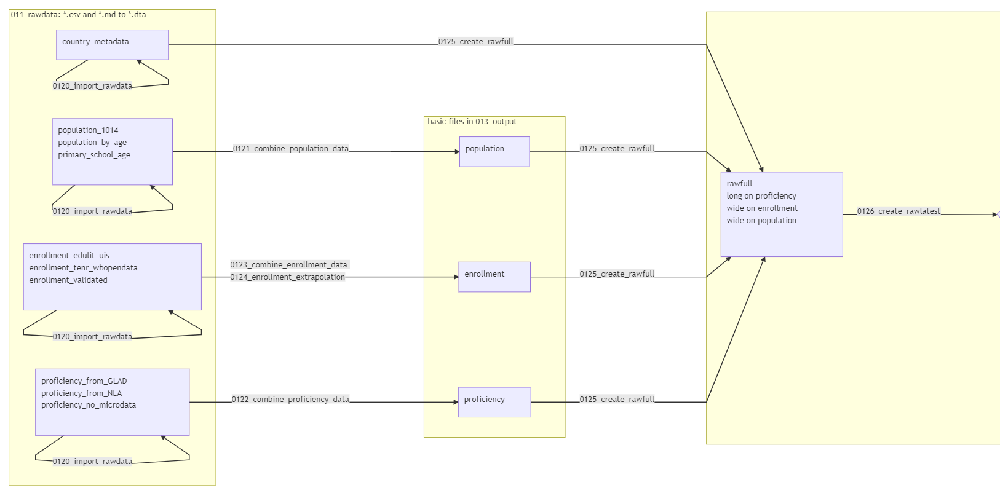
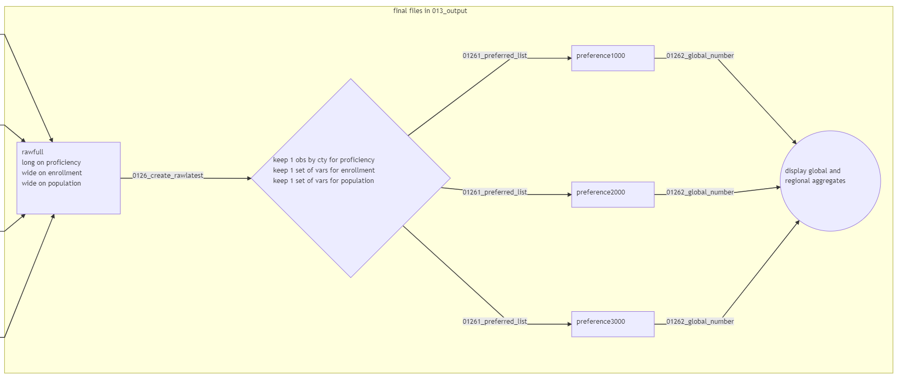
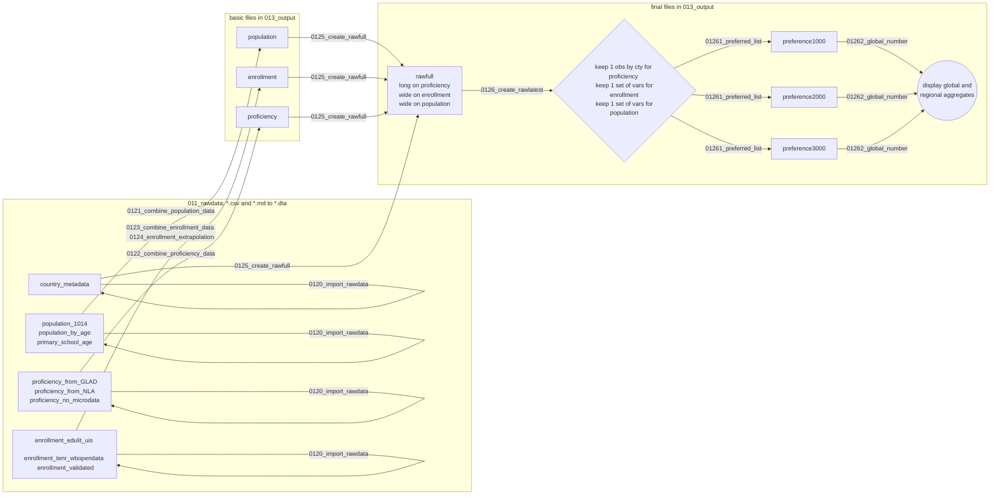

# How this repo is structured
back to the [README](https://github.com/worldbank/LearningPoverty/blob/master/README.md) :leftwards_arrow_with_hook:

### Table of Contents
1. [Folder and file structure](#folder-and-file-structure)
1. [Task details](#task-details)  
  2.0. [Task 00_documentation](#task-00_documentation)  
  2.1. [Task 01_data](#task-01_data)  
  2.2. [Task 02_simulation](#task-02_simulation)  
  2.3. [Task 03_export_tables](#task-03_export_tables)  
  2.4. [Task 04_repo_update](#task-04_repo_update)  
1. [Generating flowcharts](#generating-flowcharts)

## Folder and file structure

Each folder starting with exactly two digits is a task folder. A task folder is organized as a small project to separate tasks like generating the dataset, running the simulation, producing the learning poverty briefs. Whenever possible, we strive for a consistent naming of subfolders, with most tasks 0i having the subfolders 0i1_rawdata, 0i2_programs, 0i3_outputs.

All code needed to process and copy input data sets to the local clone, and to generate all datasets from them are shared through this repository. The code can always be found in the task sub folder programs and it is numbered with a prefix that matches the folder number. This allows to immediately identify where each code fits the workflow by looking at its name.

Some files that are nor code nor datasets (PDFs, presentations etc.) are shared directly over the OneDrive folder as such files are not suitable to share over GitHub. This folder is restricted to contributors in the World Bank.

Folders that would start empty - without any files that we wish to track in the repo - will have a placeholder markdown file, just to synchronize the folder structure, for GitHub would ignore a folder if completely empty.

## Task details

### Task 00_documentation

This folder contains only markdown files that document this project, plus accompanying images.

| Sub-Folder Name | Usage |
|---|---|
|**001_technical_note**|Information on how the data was calculated and which sources were used|
|**002_repo_structure**|Guide to the folder structure and data flow in the project|
|**003_contribution_and_replication**|Guidelines for contributing to and replicating this repo||

### Task 01_data

In this task folder we generate a "picture" of learning poverty in 2015 (rawlatest), and all files needed to project learning poverty, which will be used in the simulation task. This task runs exclusively in Stata.

| Sub-Folder Name | Usage |
|---|---|
|**011_rawdata**|This folder starts empty, except for the subfolder `hosted_in_repo`, which contains 13 .csv and .md files.|
|**012_programs**|Programs that compile all data on the recent history and a current picture of learning poverty|
|**013_outputs**|This folder should start empty. It will store the outputs for the data task.|

For each relevant file in 013_outputs, we generate a mardown documentation, accessible through the links below:
* [Documentation of population](./0022_dataset_tables/population.md)
* [Documentation of enrollment](./0022_dataset_tables/enrollment.md)
* [Documentation of proficiency](./0022_dataset_tables/proficiency.md)
* [Documentation of rawfull](./0022_dataset_tables/rawfull.md)
* [Documentation of rawlatest](./0022_dataset_tables/rawlatest.md)

All the data needed for this project comes from thirteen .csv and .md files in `01_data/011_rawdata/hosted_in_repo/`. Those files  are first imported into `01_data/011_rawdata/` as .dta files, then combined into intermediate datasets. Population, enrollment and proficiency datasets are created in `01_data/013_outputs/`, then combined in an exhaustive manner into rawfull, also stored in `01_data/013_outputs/`.

From rawfull, we construct multiple _preference_ datasets, each being the result of trimming down rawfull through the _preferred_list_ program. A useful analogy is that each _preference_ is a "picture" of the world, with different camera adjustments and angles. Then, we display the global and regional numbers that each preferences represent. Lastly, we choose one preference that we baptize as rawlatest, which should be understood as the chosen "picture" for learning poverty in 2015.

### Task 02_simulation

In this task folder we project the proficiency scores in 2030. It runs partly in Stata, partly in R.

| Sub-Folder Name | Usage |
|---|---|
|**021_rawdata**|This folder should have no data on learning poverty - nor enrollment, proficiency, population - the do-files in `022_program` should only read learning poverty data from `013_outputs`. If those outputs need to be modified for any purpose for the `02_simulation` task, then that should be done in the do-files in `012_program`. This folder only contains inputs for generating the spells, that is to compare assessments over time.|
|**022_programs**|Programs that run all the simulations|
|**023_outputs**|This folder should start empty. It will store the outputs for all simulations.|

### Task 03_export_tables

In this task folder we generate tables and graphs for the Learning Poverty technical paper. We also export the data in this project as indicators to the World Bank API. It runs exclusively in Stata.

| Sub-Folder Name | Usage |
|---|---|
|**031_rawdata**|Contains only one csv, with the metadata of WB API indicators produced by this project|
|**032_programs**|Programs that export all tables and graphs|
|**033_outputs**|Starts empty, will receive all tables and graphs that went into the paper, plus the series of _learning poverty_ indicators for the WB API|

### Task 04_repo_update

For reproducibility purposes, we 'froze' the data gathered from multiple APIs and data sources in `01_data/011_rawdata/hosted_in_repo`. In this task, we update those .md and .csv input files, by running the queries to those APIs and updating the sources. It runs exclusively in Stata. Parts of this task may require access to the World Bank network.

| Sub-Folder Name | Usage |
|---|---|
|**041_rawdata**|Raw data that does not come from APIs|
|**042_programs**|Programs that update all input data files|
|**043_outputs**|Starts empty, will receive updated files that may be transfered to 011_rawdata|

## Generating flowcharts

All the diagrams and flowcharts were generated from text in a similar manner as markdown, through _mermaid_.

To update the charts, you can use the [mermaid live editor](https://mermaidjs.github.io/mermaid-live-editor/). Pasting the code in this page in the live editor will render the images displayed in this page.

As of now, the GitHub markdown renderer does not support _mermaid_, which is why the rendering can only be done by statically saving the _.png_ files in the repo. But this is a [feature that has been requested](https://github.community/t5/How-to-use-Git-and-GitHub/Feature-Request-Support-Mermaid-markdown-graph-diagrams-in-md/td-p/21967) and may one day be added to GitHub.  

#### Flowchart code of 01_data task

